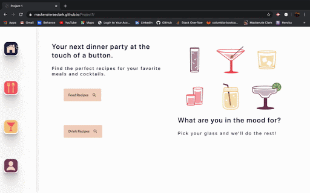

# Project1
Our application includes a simple, responsive user interface and the ability to store local data to a user profile. We based our project on two API’s housing recipe data for meals and cocktails. A user can search by name or ingredient, view the recipe’s directions and ingredient measurements, and save their desired recipes by toggling a star. The user then has access to their saved recipes and can view them on their user profile.

# Deployed
https://mackenzieraeclark.github.io/Project1/

## Desktop 

## Built With
 [Semantic Ui](https://semantic-ui.com/)

 [Cocktail DB](https://www.thecocktaildb.com/)

 [Meal DB](https://www.themealdb.com/)

